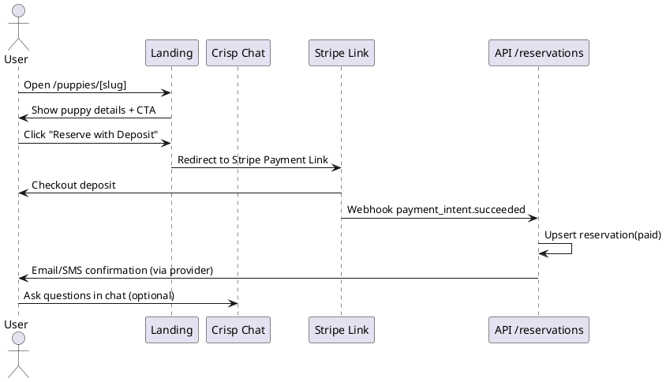

# SPEC-1-Лендинг для питомника французских и английских бульдогов

## Background

Владелец питомника планирует запустить одностраничный сайт (лендинг), чтобы представить свой бизнес по разведению и продаже французских и английских бульдогов. Цели: сформировать доверие к питомнику, показать пометы/щенков в наличии и ожидаемых, рассказать об условиях содержания, родословных и гарантии здоровья, а также собирать заявки и записи на бронирование.

**Предварительные допущения (уточнить):**

- География продаж: США, фокус — штат Алабама; возможна доставка/самовывоз по соседним штатам.
- Основная цель лендинга: заявки и быстрые контакты; предполагаю CTA: «Написать в WhatsApp/Telegram», «Позвонить», «Заполнить форму» (уточним приоритет).
- У владельца есть фото/видео щенков, родителей и документы AKC/ветпаспорта (если другое — исправим).
- Бренд-стиль: тёплый, доверительный, без «петшоп»-клише; палитра натуральных тонов.

(После подтверждения Background перейдем к разделу Requirements.)

## Requirements

**Цель:** Увеличить заявки/брони щенков по США (фокус — Алабама) и обеспечить лёгкий контакт через популярные для американцев каналы.

### MoSCoW

**Must have (обязательно):**

- Герой-блок: фото/видео, УТП, 2 CTA: «Забронировать щенка / Оставить заявку» и «Написать в мессенджер».
- Каталог щенков: «В наличии», «Ожидаемые помёты», карточки с фото, датой рождения, полом, окрасом, ценой/диапазоном, статусом (доступен/зарезервирован/продан), кнопкой «Бронь».
- Блок «О питомнике»: опыт, условия содержания, лицензии/членства (напр. AKC), гарантии здоровья, договор.
- Родители/родословные: фото/профили производителей, основные показатели здоровья.
- Каналы связи: кнопки звонка, SMS, WhatsApp, Telegram, Instagram DM, Facebook, email-форма.
- Онлайновый чат на сайте (виджет) + липкая панель быстрых контактов.
- FAQ (доставка по штатам, бронирование, оплата, здоровье/прививки, возврат депозита).
- Карта/локация (город в Алабаме) + зоны доставки и ориентировочная стоимость.
- Политики: условия брони/продажи, приватность, куки-баннер.

**Should have (желательно):**

- Отзывы клиентов (текст + фото/видео), рейтинги из соцсетей.
- Галерея/Stories: Reels/Shorts с щенками, условиями содержания.
- Подписка на рассылку/Telegram-канал о новых помётах.
- Микроразметка SEO (Organization, Product, FAQ), локальное SEO (NAP, схема «PetStore/Breeder»).
- Аналитика: GA4 + конверсионные события для каждого канала связи.

**Could have (по возможности):**

- Калькулятор доставки/перевозки щенка по штатам.
- Блог/новости о помётах, уходе, тренировках.
- Мультиязычность (EN/RU) при необходимости.

**Won’t have (исключаем из MVP):**

- Полноценный личный кабинет покупателя — отложим до следующей итерации.

**Допущения:**

- Разрешено принимать депозиты онлайн (через Stripe/PayPal) — подтвердим в методе.
- Фото/видео и все тексты предоставляет владелец; базовый копирайтинг сделаем в рамках проекта.

(После подтверждения Requirements перейдём к разделу Method.)

## Method

**Бренд/язык:** Exotic Bulldog Level, язык интерфейса — English (US).

### Технологический стек (MVP)

- **Frontend/SSR:** Next.js 15 (App Router) + React, Tailwind CSS v4 для стилизации, shadcn/ui + lucide-react для базовых компонентов.
- **Хостинг/CI:** Vercel (preview-ветки из Git). CDN для картинок — встроенный `next/image` + оптимизация.
- **Бэкенд:** Встроенные Route Handlers/Server Actions в Next.js для форм и webhook’ов.
- **Хранилище данных:** Supabase (PostgreSQL + Row Level Security) для карточек щенков/помётов/заявок.
- **Медиа:** Supabase Storage (или S3-совместимое) для фото/видео.
- **Онлайн-чат:** Crisp (виджет на всех страницах, события открытий/сообщений).
- **Платежи (депозит/бронь):** Stripe Payment Links (депозит фиксированной суммы, возможность возврата по политике питомника) + PayPal Smart Buttons.
- **Аналитика/маркетинг:** GA4 (через Google Tag или GTM), Meta Pixel для Facebook/Instagram Ads, события конверсий (клики по WhatsApp/Telegram/DM/Call, отправка форм, успешная оплата депозита).
- **SEO/разметка:** Микроразметка `Organization`, `PetStore`, `Product` и `FAQ` + OpenGraph/Twitter Cards.

**Вывод для MVP:** так как у нас маркетинговый лендинг + легкая бронь депозита \$300 без сложных бэк-процессов, **оставляем Next.js full-stack**. Если позже потребуется расширенная операционная логика — вынесем Python-сервис, не ломая текущий фронт.

### Интеграции контактов (глубокие ссылки)

- **WhatsApp:** `https://wa.me/1XXXXXXXXXX?text=Hello%20from%20Exotic%20Bulldog%20Level` (номер в международном формате без символов).
- **Telegram:** `https://t.me/<username>`.
- **Instagram DM:** `https://ig.me/m/<username>` (официальный шортлинк Meta для открытия диалога в Instagram).
- **Call/SMS:** `tel:+1XXXXXXXXXX`, `sms:+1XXXXXXXXXX`.

### Архитектура страниц и блоков

- **/ (Home/Landing):** hero (фото/видео), УТП, 2 CTA (Reserve / Message), доверие (гарантии, AKC, условия), карусель «Available Puppies», «Upcoming Litters», «Parents», отзывы, FAQ, карта (Алабама), липкая панель быстрых контактов.
- **/puppies:** сетка карточек фильтруемая (порода: French/English, пол, окрас, статус, цена/диапазон). Детальная страница щенка `/puppies/[slug]` с галереей, родителями, датой рождения, статуса и кнопками Reserve/Message.
- **/about:** о питомнике, команда, условия содержания, документы.
- **/policies:** бронирование/оплата/возврат депозита/доставка/здоровье.
- **/contact:** форма + все каналы.

### Схема данных (PostgreSQL)

```sql
create extension if not exists pgcrypto;

-- Породы
create table breeds (
  id uuid primary key default gen_random_uuid(),
  name text not null check (name in ('French Bulldog','English Bulldog'))
);

-- Родители
create table parents (
  id uuid primary key default gen_random_uuid(),
  name text not null,
  breed_id uuid references breeds(id),
  sex text not null check (sex in ('male','female')),
  color text,
  pedigree_url text,
  health_tests jsonb default '{}'::jsonb,
  photo_urls text[] default '{}'
);

-- Помёты
create table litters (
  id uuid primary key default gen_random_uuid(),
  breed_id uuid references breeds(id),
  sire_id uuid references parents(id),
  dam_id uuid references parents(id),
  mating_date date,
  due_date date,
  born_at date,
  notes text
);

-- Щенки
create table puppies (
  id uuid primary key default gen_random_uuid(),
  litter_id uuid references litters(id),
  name text,
  slug text unique,
  sex text check (sex in ('male','female')),
  color text,
  birth_date date,
  price_usd numeric(10,2),
  status text not null check (status in ('available','reserved','sold','upcoming')) default 'available',
  weight_oz int,
  description text,
  photo_urls text[] default '{}',
  video_urls text[] default '{}',
  paypal_enabled boolean default true,
  stripe_payment_link text
);

-- Бронирования/депозиты
create table reservations (
  id uuid primary key default gen_random_uuid(),
  puppy_id uuid references puppies(id),
  customer_name text,
  customer_email text,
  customer_phone text,
  channel text check (channel in ('site','whatsapp','telegram','instagram','facebook','phone')),
  status text check (status in ('pending','paid','refunded','canceled')) default 'pending',
  deposit_amount numeric(10,2),
  stripe_payment_intent text,
  payment_provider text check (payment_provider in ('stripe','paypal')),
  paypal_order_id text,
  notes text,
  created_at timestamptz default now()
);

-- Заявки/контакты
create table inquiries (
  id uuid primary key default gen_random_uuid(),
  source text check (source in ('form','whatsapp','telegram','instagram','facebook','phone')),
  name text,
  email text,
  phone text,
  message text,
  puppy_id uuid references puppies(id),
  utm jsonb default '{}'::jsonb,
  created_at timestamptz default now()
);

create index on puppies (status);
create index on inquiries (created_at);
create index if not exists reservations_puppy_status_idx on reservations (puppy_id, status);
create index if not exists puppies_slug_idx on puppies (slug);
```

### Компоненты и взаимодействия (PlantUML)

```plantuml
@startuml
skinparam componentStyle rectangle

actor Visitor as V
component "Next.js App (Vercel)
SSR/ISR + API Routes" as Next
component "Supabase
(PostgreSQL + Storage)" as DB
component "Crisp Widget" as Crisp
component "Stripe Payment Links" as Stripe
component "GA4 / Meta Pixel" as Analytics

V --> Next : View pages, submit forms
Next --> DB : read/write puppies, litters, reservations, inquiries
V --> Crisp : live chat
V --> Stripe : open payment link (deposit)
Next --> Analytics : events (CTA clicks, form submit)
Stripe --> Next : webhook (payment succeeded)
Next --> DB : update reservations.status = paid
@enduml
```

### Пользовательские сценарии (упрощённо)



### Контент и медиа

- Профессиональные фото/видео для hero и карточек (минимум 6–8 фото на щенка, 30–60с видео).
- Короткие вертикальные клипы для Reels/TikTok/YouTube Shorts, встраиваемые в галерею.
- Тексты: УТП, гарантии здоровья, условия брони/возврата, доставка по штатам.

### Трекинг конверсий (события)

- `contact_click` (label: whatsapp/telegram/instagram/call/sms/email).
- `reserve_click` (label: puppy\_slug).
- `form_submit` (lead) и `form_success`.
- `deposit_paid` (value: amount, label: puppy_slug, params: payment_provider).

### Безопасность и приватность

- reCAPTCHA (или hCaptcha) на формах.
- Политика приватности и cookie consent.
- RLS в Supabase для изоляции записей; админ-доступ через сервисный ключ, не на клиенте.

(После подтверждения Method перейдём к разделу Implementation.)

## Implementation

### 0) Домены и деплой

1. Зарегистрировать домен (например, exoticbulldoglevel.com) у регистратора (Namecheap/Google Domains/Cloudflare Registrar).
2. Создать проект на **Vercel** → импортировать GitHub-репозиторий `exotic-bulldog-level-site`.
3. Привязать домен к проекту (DNS через A/ALIAS/CNAME согласно Vercel). Включить HTTPS (Let’s Encrypt автоматом).

### 1) Инициализация проекта

- `npx create-next-app@latest` (Next.js App Router) → Tailwind CSS → Typescript.
- Установить UI-библиотеки: `shadcn/ui`, `lucide-react`.
- Добавить `@vercel/analytics` (по желанию), настроить `next-seo` для мета-тегов/OG.

### 2) База данных и файлы

- Создать проект **Supabase** → включить **Postgres** и **Storage**.
- Выполнить SQL-схемы из раздела *Method → Схема данных*.
- Включить **Row Level Security** на таблицах (по умолчанию в Supabase); создать сервисную роль для серверных операций.
- Создать бакеты: `puppies`, `parents`, `litters`. Включить подписи URL или публичный доступ с ограничениями.

### 3) Контент и страницы

- Страницы: `/`, `/puppies`, `/puppies/[slug]`, `/about`, `/policies`, `/contact`.
- Компоненты: `Hero`, `PuppyCard`, `PuppyGallery`, `ContactBar` (липкая панель), `FAQ`, `Reviews`.
- Форма заявки (`/contact` и модалка на лендинге) → Server Actions: запись в `inquiries` + отправка email-уведомления владельцу.

### 4) Оплата депозита (Stripe + PayPal)

- **Stripe Payment Links** (MVP, самый быстрый путь):
  - В Stripe создать **Price** (например, `deposit_300_usd`).
  - Создать **Payment Link** с этим Price. Включить Apple Pay/Google Pay, Link.
  - В карточке щенка хранить `stripe_payment_link` и открывать в новой вкладке по кнопке **Reserve**.
  - Обработать `payment_intent.succeeded` вебхуком (Next.js Route Handler `/api/stripe/webhook`) → обновить `reservations.status = 'paid'` и связать с `puppy_id` (метаданные в ссылке или URL-параметры).
- **PayPal Checkout (Smart Buttons)** — альтернатива/второй способ оплаты депозита:
  - Подключить PayPal JS SDK на странице щенка, отрисовать кнопку PayPal.
  - `createOrder` → сумма депозита (например, \$300).
  - `onApprove` → `actions.order.capture()` и POST на `/api/paypal/capture` для записи `reservations` в БД.
  - Опционально включить **Venmo** для США и **Pay Later** (если разрешено правилами PayPal и бизнес-категорией).

> В политике укажем: депозит невозвратный/условия возврата, сроки брони, доставка. Включим сбор налогов/комиссий, если применимо.

### 5) Чат и каналы связи

- Установить виджет **Crisp** (скрипт в `<head>` или через `next/script`).
- Настроить приветствие, автоответы, события (клики по CTA) и идентификацию пользователя по email/телефону, если он заполнил форму.
- Добавить панель быстрых контактов (кнопки: Call, SMS, WhatsApp, Telegram, Instagram DM, Email) — фиксированная снизу.

### 6) SEO и локальное присутствие

- JSON-LD (`Organization`, `LocalBusiness`/`PetStore`, `Product` для щенков, `FAQPage`).
- Заголовки и тексты на английском (US), целевые ключи: "French Bulldog puppies in Alabama", "English Bulldog breeder Alabama", и т. п.
- Страница Google Business Profile (как только будет домен и адрес общения/зоны доставки).
- Блок NAP в футере: **Exotic Bulldog Level**, адрес **[указать город, AL]**, телефон в формате **+1XXXXXXXXXX**.

### 7) Аналитика и пиксели

- Подключить **GA4** и **Meta Pixel**. События: `contact_click`, `reserve_click`, `form_submit`, `deposit_paid`.
- Настроить цели/конверсии в GA4 и Meta (кросс-канальная атрибуция рекламы из FB/IG).

### 8) Тестирование и релиз

- Smoke-тесты UI (Playwright) для главных сценариев.
- Тест платежей в песочницах Stripe/PayPal.
- Проверка производительности (Lighthouse), изображений (Next/Image), корректности адаптива (мобильная «первичность»).

**Переменные окружения (Vercel):**

- `NEXT_PUBLIC_SITE_URL`
- `SUPABASE_URL`, `SUPABASE_ANON_KEY`, `SUPABASE_SERVICE_ROLE` (server only)
- `STRIPE_SECRET_KEY`, `STRIPE_WEBHOOK_SECRET`
- `PAYPAL_CLIENT_ID`, `PAYPAL_CLIENT_SECRET`
- `NEXT_PUBLIC_CRISP_WEBSITE_ID`
- `NEXT_PUBLIC_GA_MEASUREMENT_ID`, `META_PIXEL_ID`

## Milestones

**0. Kickoff (0.5 дня)**  
- Создать репозиторий, проект Vercel, Supabase проект, Crisp рабочее пространство.  
**DoD:** доступы работают, dev-деплой открыт.

**1. Каркас и стиль (2–3 дня)**  
- Макет страниц: Home, Puppies, Puppy Details, About, Policies, Contact.  
- Tailwind/shadcn, липкая панель контактов, базовый логотип/бренд.  
**DoD:** адаптив готов, Lighthouse ≥ 90 (Perf/SEO) на демоданных.

**2. База и контент (2–3 дня)**  
- Применить SQL-схему, включить RLS, настроить Storage бакеты.  
- Наполнить 8–12 карточек, загрузить фото/видео (сжатие до ~1600px ширины).  
**DoD:** листинг и карточки читаются из БД, фильтры работают.

**3. Чат и каналы связи (0.5 дня)**  
- Подключить Crisp (приветствие, офлайн), deep links Call/SMS/WA/TG/IG/Email.  
**DoD:** письма/сообщения из чата доходят, события кликов ловятся в GA4.

**4. Оплата депозита $300 (2 дня)**  
- Stripe Payment Link + PayPal Smart Buttons на странице щенка.  
- Webhooks: Stripe `/api/stripe/webhook`, PayPal `/api/paypal/capture` или webhook.  
- Запись `reservations` (`paid`, `payment_provider`).  
**DoD:** успешный тест-платёж меняет статус щенка на `reserved`.

**5. SEO/локалка и доверие (1–2 дня)**  
- JSON-LD (Organization, LocalBusiness/PetStore, Product, FAQPage), OG.  
- Блок NAP (город AL, телефон +1), Policies, FAQ, Reviews (4–6).  
**DoD:** Rich Results Test без ошибок, контент опубликован.

**6. Аналитика и конверсии (0.5–1 день)**  
- GA4 + Meta Pixel, события: `contact_click`, `reserve_click`, `form_submit`, `deposit_paid`.  
**DoD:** видны тестовые конверсии в отчетах.

**7. Релиз (0.5 дня)**  
- Тесты (Playwright) главных сценариев, hCaptcha на формах, финальный прогон.  
**DoD:** прод-деплой на *.vercel.app, готов к привязке домена.

> Примерная длительность: ~7–10 рабочих дней в одном лице.

## Gathering Results

**Цели и KPI (первые 30–60 дней):**
- Конверсия в контакт/заявку с лендинга: **≥ 3–5%**.  
- Доля кликов по быстрым контактам (WA/TG/Call/SMS/IG): **≥ 10%** от сессий.  
- Депозиты (проверка цепочки): **≥ 1–2** в неделю при 300–500 визитах.  
- LCP мобильный: **≤ 2.5s**, CLS **≤ 0.1**.

**Как измеряем:**
- GA4: события и конверсии по каналам (метки `channel`, `puppy_slug`, `payment_provider`).  
- Crisp: количество диалогов/ответов/офлайновых сообщений.  
- Stripe/PayPal: успешные депозиты, возвраты.  
- Lighthouse/Pagespeed: перформанс и SEO еженедельно.

**Итерации улучшений:**
- A/B геро-блока (фото, текст УТП, 2 CTA).  
- Упрощение формы (минимум полей), добавление «callback» кнопки.  
- Оптимизация изображений, автогенерация WebP/AVIF.


